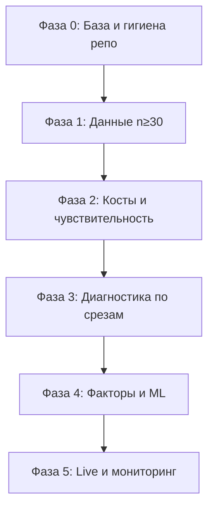

# Дорожная карта: SwingV2 + research + live бот

Документ задаёт **порядок работ без циклов**: сначала данные и честная экономика, потом диагностика, потом факторы/ML, потом интеграция в бота. Цель — воспроизводимые решения, а не «подкрутка под gate».

---

## 1. Неприкосновенные принципы

| Принцип | Практика |
|--------|----------|
| Нет lookahead | Фичи и фильтры только из информации, доступной **на закрытии бара входа** (как сейчас в pipeline). |
| Нет подгонки под edge_gate на одном CSV | Любой проход gate должен повторяться на **другом периоде или инструменте** (holdout / walk-forward). |
| Объём сделок не цель | Не ослаблять фильтры только чтобы набрать n — сначала **expectancy > 0** на обоснованной выборке. |
| PnL в research | Колонка `pnl`: **₽ на 1 контракт** при `qty=1` в бэктесте; масштаб счёта = × контракты. |
| Фальсификация — норма | «Нет edge» — валидный итог; фиксируется в отчёте и не скрывается. |

---

## 2. Карта фаз (зависимости)

Нельзя **честно** завершить фазу 4, пока фаза 1 не дала достаточную выборку по целевому TF×инструмент.

---

## 3. Фаза 0 — база (1–2 дня)

**Цель:** одинаковый запуск research и предсказуемые артефакты.

| Шаг | Действие | Готово, когда |
|-----|----------|----------------|
| 0.1 | Зафиксировать команду batch: `python -m quant.research.run_pipeline --batch-dir ... --glob "history_*_6m.csv" --out-dir ...` | README / этот документ обновлены |
| 0.2 | Edge gate: порог PF задаётся явно: `--edge-min-pf` (по умолчанию 1.2; **строгая проверка цели — 1.3**) | CLI работает, значение видно в `edge_gate_detail.json` (косвенно: условия `profit_factor_below_threshold`) |
| 0.3 | `pytest` зелёный перед любыми изменениями стратегии | CI / локально |
| 0.4 | Не удалять `fix_engine/fix_shim.py` — используется gateway/брокером; при желании только переименовать с правкой импортов | Риски задокументированы |

**Выход:** чеклист команд; нет «магических» ручных копирований CSV.

---

## 4. Фаза 1 — данные (критический путь)

**Цель:** по каждому сценарию (TF × инструмент) **n ≥ 30** сделок при **текущей** логике входа или осознанно суженной (другой TF/инструмент).

| Шаг | Действие | Готово, когда |
|-----|----------|----------------|
| 1.1 | Увеличить глубину истории: `days` 183 → **365–730** в `fetch_research_bundle` / `fetch_tbank_candles_history` | Новые `history_*.csv`, контроль длины ряда для HTF (1h/4h) |
| 1.2 | Несколько ликвидных инструментов: manifest YAML с 3–5 тикерами, один прогон `run_pipeline` | `batch_summary_metrics.csv` + `batch_cross_instrument_factors.csv` |
| 1.3 | Лог качества: пропуски баров, нулевой объём (если есть volume) — скрипт или заметка в README | Минимум ручная проверка на одном файле |
| 1.4 | Зафиксировать **канонический** набор файлов в репо; тяжёлые дубликаты run — не коммитить (см. `.gitignore` комментарии) | Один источник правды по именам `history_*.csv` |

**Критерий фазы:** для хотя бы одного TF на инструменте **n ≥ 30**; иначе фазы 3–4 не считаются статистически оправданными.

---

## 5. Фаза 2 — косты и чувствительность

**Цель:** отрицательный PnL не объясняется только **завышенно оптимистичными** комиссией/проскальзыванием.

| Шаг | Действие | Готово, когда |
|-----|----------|----------------|
| 2.1 | Базовый прогон: `commission_rate`, `slippage_ticks` как в `SwingBreakoutParams` для live | Один эталонный `pnl_estimate.json` |
| 2.2 | Сетка: slippage ±1–2 тика, комиссия ±20% — таблица суммарного PnL / PF | Markdown-таблица или CSV в `docs/` или рядом с run |
| 2.3 | Если при пессимистичных костах edge исчезает — **не** лечить стратегией, сначала исполнение/тайминг | Запись вывода в roadmap (подпункт) |

**Критерий:** понятно, «edge есть в принципе» или «убивает микроструктура».

---

## 6. Фаза 3 — диагностика по срезам (без новых фич)

**Цель:** локализовать проблему: тип сделки, режим, TF.

| Шаг | Действие | Готово, когда |
|-----|----------|----------------|
| 3.1 | Агрегаты по `setup_tag` (continuation / pullback / …) × TF: n, sum_pnl, PF, expectancy | Скрипт или ноутбук; артефакт CSV |
| 3.2 | Срез по `market_regime` (из `swing_v2`): тренд vs флэт vs отсутствие входа | Таблица метрик |
| 3.3 | Сопоставление TF и волатильности: ATR%, `alpha_v2_vol_regime` на баре входа | Решение: базовый TF для инструмента |
| 3.4 | Запрет на «выкинуть худший тег» без holdout: правило вносится только после повтора на **2-й** выборке | Запись в changelog |

**Критерий:** есть гипотеза «что отключить/ужесточить» с **номером строки** в логике (FSM / score / фильтр режима).

---

## 7. Фаза 4 — факторы и ML

**Цель:** устойчивые факторы и взаимодействия, не переобучение на n<30.

| Шаг | Действие | Готово, когда |
|-----|----------|----------------|
| 4.1 | Минимальный n в бине фактора: не интерпретировать бины с n<5–10; при необходимости снизить число квантилей | Правило зафиксировано |
| 4.2 | Edge gate: `expectancy > 0`, `PF ≥ edge_min_pf`, `pnl_wo_top1 > 0`, `n ≥ 30`, факторы/интеракции | Запуск с `--edge-min-pf 1.3` для целевой проверки |
| 4.3 | Holdout: `pnl_estimate.json`; хронологические **бакеты по сделкам** — `walk_forward_trade_buckets` (CLI `--walk-forward-buckets`, см. `docs/walk_forward_spec.md`) | Полный walk-forward по барам — отдельный этап |
| 4.4 | Реконструкция весов (`reconstruct.py`) — только после стабильного прохода gate на двух выборках | Явное правило |

**Критерий:** ≥2 стабильных фактора **или** подтверждённые интеракции **и** повтор на втором инструменте/периоде.

---

## 8. Фаза 5 — live бот

**Цель:** совпадение research и production по параметрам и риску.

| Шаг | Действие | Готово, когда |
|-----|----------|----------------|
| 5.1 | Таблица соответствия: `SwingBreakoutParams`, score policy, HTF — research vs `settings` / раннер | Документ |
| 5.2 | Размер позиции: `risk_per_trade_rub`, лимиты — не менять вместе с исследованием без отдельного теста | Чеклист |
| 5.3 | Мониторинг: PF, expectancy, просадка на скользящем окне live — не путать с backtest | Минимум логи/экспорт |

---

## 9. Критерии успеха (release research)

Все **обязательны** для объявления «стратегия готова к расширению капитала»:

| Показатель | Условие |
|------------|---------|
| Выборка | n ≥ 30 на **каждом** заявленном TF×инструмент |
| PF | ≥ **edge_min_pf** (целевой жёсткий режим: **1.3** через `--edge-min-pf 1.3`) |
| Устойчивость | pnl без top-1 > 0 |
| Экстраполяция 6м | положительное ожидание **после** того же порога по PF/expectancy (не отдельная подгонка) |
| Повтор | holdout или второй инструмент/период без противоречия знака expectancy |
| Gate | `edge_gate` passed + не флаг `unreliable` из-за n |

---

## 10. Новые признаки и фильтры (после фазы 3)

Добавлять **только** с обоснованием из фазы 3 и проверкой на второй выборке:

- Явные бакеты сессии (открытие / середина / закрытие), не только час.
- Фильтр ликвидности по объёму (percentile за прошлое окно).
- Согласование с HTF VWAP / трендом — в рамках уже считаемых колонок.
- Не дублировать то, что уже в `alpha_*` / `alpha_v2_*` / `alpha_v3_*` без ablation.

---

## 11. Очистка репозитория

| Действие | Примечание |
|----------|------------|
| **Оставить** `fix_engine/fix_shim.py` | Зависимости: `execution/gateway.py`, `tbank_broker.py`. |
| **Не коммитить** дубликаты выводов: `strategy_run_*`, `quant_batch_*`, копии `research_*` в `fix_engine/backtest/` | См. комментарии в `.gitignore`; канон — manifest + одна папка run. |
| Периодически | `python -m compileall`, поиск мёртвых импортов после удаления модулей. |

---

## 12. Чеклист перед merge в master (стратегия + бот)

- [ ] `pytest` зелёный  
- [ ] Batch research на **каноническом** наборе CSV  
- [ ] Для изменений логики: отчёт по срезам (фаза 3) или явное «не применимо»  
- [ ] Параметры костов согласованы с live  
- [ ] README ссылается на этот документ  

---

## 13. Ссылки на код

| Компонент | Путь |
|-----------|------|
| Research pipeline | `quant/research/run_pipeline.py` |
| Edge gate | `quant/research/edge_gate.py` |
| Обогащение OHLCV | `quant/data/pipeline.py` |
| Режим / VWAP | `fix_engine/strategy/swing_v2.py` |
| Score | `fix_engine/strategy/signal_scoring.py` |
| Бэктест FSM | `fix_engine/strategy/swing_breakout.py` |

---

*Версия: привязана к репозиторию; при смене контрактов edge gate или MIN_TRADES_RELIABLE обновить этот файл.*
